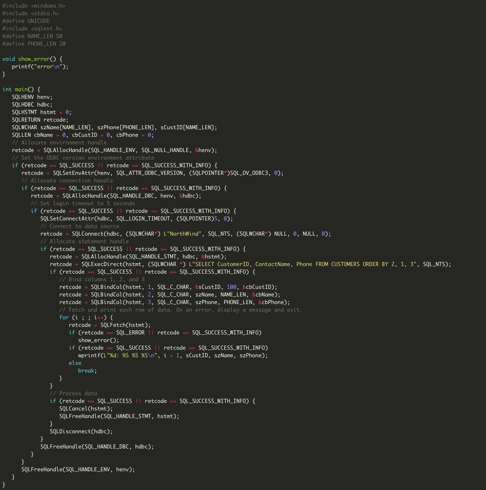
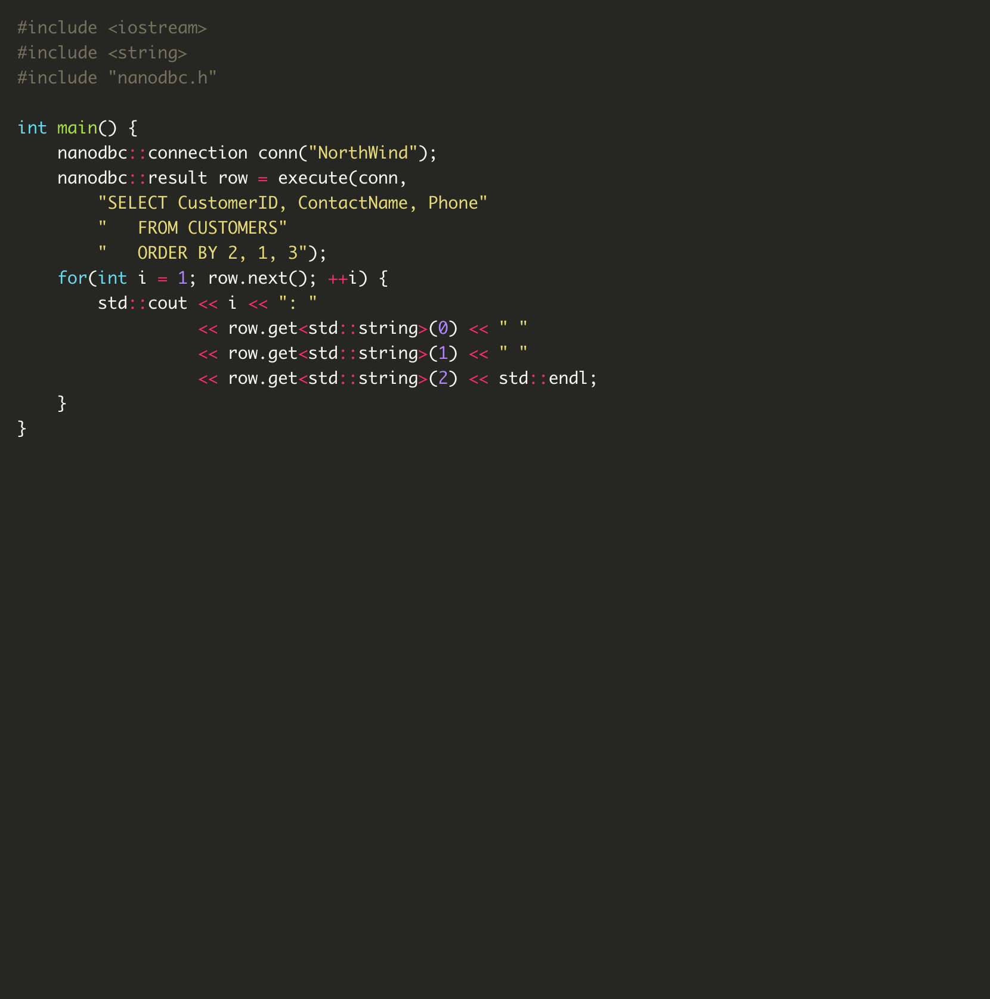

.. _index:

##############################################################################
nanodbc - C++ wrapper for ODBC API
##############################################################################

nanodbc is a small library that makes ODBC API programming easy and fun again.

Documentation for the latest version `v2.14.0`_.

Documentation for previous versions:
  - `v2.13.0`_ is `here <https://nanodbc.github.io/nanodbc/v2.13.0>`_.
  - `v2.12.4`_ is `here <https://nanodbc.github.io/nanodbc/v2.12.4>`_.

******************************************************************************
Motivation
******************************************************************************

Here's a before and after look at straight ODBC C API code and its equivalent nanodbc code.

|before| |after|

The native C API for working with ODBC is exorbitantly verbose, ridiculously
complicated, and fantastically brittle. nanodbc addresses these frustrations!
The goal for nanodbc is to make developers happy.

The nanodbc philosophy states: common database programming tasks
should be easy, requiring concise and simple code.

The latest `C++ standard`_ and `C++ best practices`_ are enthusiastically
incorporated to make the library as future-proof as possible.

To accommodate users who can not use the latest and greatest,
`semantic versioning`_ and release notes will clarify required C++ features
and/or standards for particular versions.

******************************************************************************
History
******************************************************************************

Originally nanodbc began as a simple fork of `TinyODBC`_ with additional
features. Eventually it grew to the point where it made sense to break with
many of the basic underlaying design decisions of TinyODBC and completely
refactor much of the codebase. Other projects that have had influence on
nanodbc include `SimpleDB`_, `pyodbc`_, `Database Template Library`_,
and `GSODBC`_.

******************************************************************************
Features
******************************************************************************

Why should you use nanodbc?

* Small! Same as TinyODBC, nanodbc is small. A header and an implementation file.
* Simple! There are only a handful of significant classes to learn.
* Portable! nanodbc uses only standard C++ headers in addition to the ODBC API headers.
* Robust! Where it makes sense, error handling is done with exceptions instead of return codes.
* Features! nanodbc supports ODBC 3, SQLDriverConnect(), Transactions, Bound Parameters, Bulk Operations, and much more.
* Documented! I have tried to provide very clean and useful documentation with example usage.
* Active! I am currently actively using and developing nanodbc so I hope to add more and more features all the time.

******************************************************************************
Design
******************************************************************************

All complex objects in nanodbc follow the `pimpl`_ (Pointer to IMPLementation) idiom to provide separation between interface and implementation, value semantics, and a clean nanodbc.h header file that includes nothing but standard C++ headers.

nanodbc wraps ODBC code, providing a simpler way to do the same thing. We try to be as featureful as possible, but I can't guarantee you'll never have to write supporting ODBC code. Personally, I have never had to do so.

Major features beyond what's already supported by ODBC are not within the scope of nanodbc. This is where the nano part of nanodbc becomes relevant: This library is as minimal as possible. That means no dependencies beyond standard C++ and typical ODBC headers. No features unsupported by existing ODBC API calls.

.. toctree::
  :hidden:

  install
  use
  develop
  api

.. _`v2.14.0`: https://github.com/nanodbc/nanodbc/releases/tag/v2.14.0
.. _`v2.13.0`: https://github.com/nanodbc/nanodbc/releases/tag/v2.13.0
.. _`v2.12.4`: https://github.com/nanodbc/nanodbc/releases/tag/v2.12.4
.. _`TinyODBC`: https://code.google.com/archive/p/tiodbc/
.. _`SimpleDB`: http://simpledb.sourceforge.net
.. _`PyODBC`: https://github.com/mkleehammer/pyodbc
.. _`Database Template Library`: http://dtemplatelib.sourceforge.net
.. _`GSODBC`: http://www.codeguru.com/cpp/data/mfc_database/odbc/article.php/c4337/A-Simple-and-Smart-ODBC-Wrapper-Library.htm
.. _`C++ standard`: https://isocpp.org/std/status
.. _`C++ best practices`: https://github.com/isocpp/CppCoreGuidelines
.. _`semantic versioning`: http://semver.org
.. _`pimpl`: http://wiki.c2.com/?PimplIdiom
.. _`releases`: https://github.com/nanodbc/nanodbc/releases

